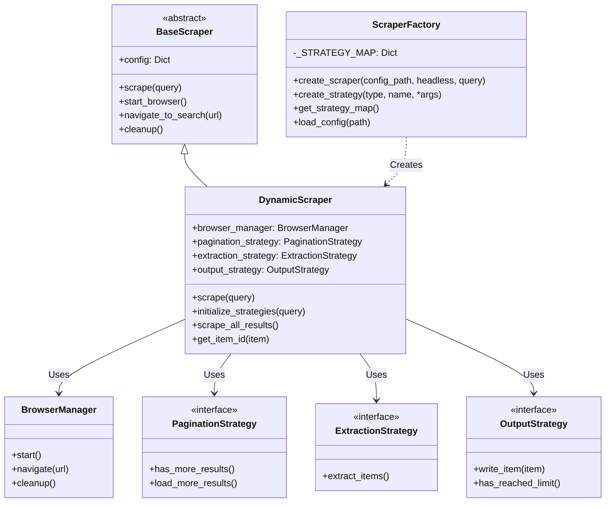

# Google Maps Scraper Knowledge Base & Architecture Reference

> **CRITICAL INSTRUCTION FOR AGENTS:**
> Before acting on ANY information in this file or the codebase, you MUST verify that this document reflects the **current state** of the code.
> 1.  **Read this file** to understand the intended architecture.
> 2.  **Verify** against actual code files (e.g., `base/scraper.py`, `factory/scraper_factory.py`) using `read` or `grep`.
> 3.  **If discrepancies exist:** You MUST update this file to match the code BEFORE proceeding with any other task.
> 4.  **If you modify code:** You MUST update this file to reflect those changes immediately after implementation.

---

## 1. System Architecture Overview

### Core Design Pattern
The framework uses a **Strategy-based Factory pattern** combined with **Configuration-Driven Design**.
-   **Orchestrator (`DynamicScraper`)**: Manages the high-level scraping lifecycle (browser, navigation, looping).
-   **Strategies**: Encapsulate specific behaviors (Pagination, Extraction, Output) that can be swapped at runtime.
-   **Factory (`ScraperFactory`)**: Instantiates the correct scraper and strategies based on YAML configuration.
-   **Configuration (`config/*.yaml`)**: Defines *what* to scrape and *which* strategies to use.

### Component Interaction Diagram

## 2. Directory Structure & Key Files

| Path | Purpose | Key Components |
| :--- | :--- | :--- |
| `base/` | Abstract Base Classes & Core Interfaces | `scraper.py`, `strategies.py`, `browser_manager.py` |
| `factory/` | Object Creation & Dependency Injection | `scraper_factory.py` |
| `scrapers/` | High-Level Orchestrators | `dynamic_scraper.py` |
| `strategies/` | Concrete Implementation Logic | `pagination/`, `extraction/`, `output/` |
| `config/` | YAML Configuration Files | `google_maps.yaml`, `yelp_example.yaml` |
| `output/` | Data Persistence Directory | `*.jsonl` files |
| `main.py` | CLI Entry Point | Argument parsing, logging setup |
| `.agents/` | Agent Personas & Protocols | `knowledge-base.md`, `refinement-agent.md` |
| `AGENTS.md` | Project-Wide AI Protocol | Core directives, constraints, style guide |

## 3. API Reference

### Base Classes (`base/`)

#### `BaseScraper` (`base/scraper.py`)
-   `__init__(self, config: Dict, **kwargs)`: Initializes config and state.
-   `scrape(self, query: str)`: Abstract method for main execution.
-   `start_browser(self)`: Abstract method to launch browser.
-   `navigate_to_search(self, url: str)`: Abstract method to load target URL.
-   `cleanup(self)`: Abstract method to release resources.

#### `PaginationStrategy` (`base/strategies.py`)
-   `has_more_results(self) -> bool`: Checks if more pages/scrolls exist.
-   `load_more_results(self) -> bool`: Executes the action (click/scroll) to load more. Returns `True` if successful.

#### `ExtractionStrategy` (`base/strategies.py`)
-   `extract_items(self) -> List[Dict]`: Parses current page content into structured data.

#### `OutputStrategy` (`base/strategies.py`)
-   `write_item(self, item: Dict)`: Persists a single item.

### Implementations

#### `DynamicScraper` (`scrapers/dynamic_scraper.py`)
-   **Key Logic**:
    -   `get_search_url(query)`: Substitutes `{query}` in template.
    -   `initialize_strategies(query)`: Uses Factory to create strategy instances. Handles `{query}` substitution in output path.
    -   `scrape_all_results()`: Main loop: Check limit -> Check more results -> Extract -> Write -> Load more -> Sleep.
    -   `get_item_id(item)`: Generates hash for duplicate detection.

#### `BrowserManager` (`base/browser_manager.py`)
-   Wraps `nodriver` (and potentially others).
-   `start()`: Launches headless browser.
-   `navigate(url)`: Loads URL and waits for page load.

#### `ScraperFactory` (`factory/scraper_factory.py`)
-   **Lazy Loading**: Uses `get_strategy_map()` to import strategy classes only when needed to prevent circular imports.
-   `create_scraper(config_path, **kwargs)`: Creates scraper based on `content_type` ("dynamic" -> `DynamicScraper`).
-   `create_strategy(type, name, *args, **kwargs)`: Instantiates specific strategy classes.

## 4. Configuration Schema Reference

Configurations are stored in `config/*.yaml`.

| Field | Type | Description | Default/Example |
| :--- | :--- | :--- | :--- |
| `name` | string | Scraper identifier | "Google Maps" |
| `content_type` | string | "dynamic" (nodriver) or "static" (requests) | "dynamic" |
| `browser_automation` | string | Engine to use | "nodriver" |
| `headless` | bool | Run browser without UI | `true` |
| `search_url_template` | string | URL pattern with `{query}` placeholder | `https://site.com/search?q={query}` |
| `pagination_strategy` | string | Strategy name | "infinite_scroll", "next_button" |
| `extraction_strategy` | string | Strategy name | "generic_selector" |
| `output_strategy` | string | Strategy name | "jsonl_file" |
| `selectors` | dict | CSS selectors for extraction | `{items: "div.card", fields: {...}}` |
| `pagination` | dict | Pagination-specific settings | `{container: "div.feed", max_scroll_attempts: 500}` |
| `output` | dict | Output settings | `{file_path: "output/data_{query}.jsonl", max_results: 100}` |
| `rate_limit` | int | Seconds to wait between actions | `2` |

## 5. Extension Guide

### Adding a New Pagination Strategy
1.  Create `strategies/pagination/my_strategy.py`.
2.  Inherit from `PaginationStrategy`.
3.  Implement `has_more_results()` and `load_more_results()`.
4.  Register in `factory/scraper_factory.py` inside `_STRATEGY_MAP`.

### Adding a New Extraction Strategy
1.  Create `strategies/extraction/my_extractor.py`.
2.  Inherit from `ExtractionStrategy`.
3.  Implement `extract_items()`.
4.  Register in `factory/scraper_factory.py`.

### Adding a New Website
1.  Create `config/new_site.yaml`.
2.  Define `search_url_template` and `selectors`.
3.  Choose appropriate strategies (`pagination_strategy`, etc.).
4.  Run using `uv run python main.py --config config/new_site.yaml --query "foo"`.

## 6. Optimization & Best Practices

-   **Memory**: `DynamicScraper` processes items iteratively. Ensure strategies don't accumulate massive lists in memory.
-   **Anti-Bot**: `nodriver` is used for stealth. Do not add traditional selenium/webdriver signals.
-   **Rate Limiting**: Always configure `rate_limit` (default 2s) to avoid IP bans.
-   **Imports**: Always use local imports inside Factory methods to avoid circular dependency errors.

## 7. Troubleshooting

-   **Circular Import Errors**: Usually caused by importing strategies at the top level of `scraper_factory.py`. Fix: Move imports inside `get_strategy_map()`.
-   **Selector Failures**: If `GenericSelectorExtractionStrategy` returns empty lists, use `nodriver`'s interactive mode or check `page.content` to verify DOM structure.
-   **Browser Crashes**: Ensure `headless=True` is set for server environments. Increase `timeout` in `BrowserManager.navigate()` for slow sites.

---
**LAST UPDATED:** 2026-01-18
**STATUS:** Active & Verified
