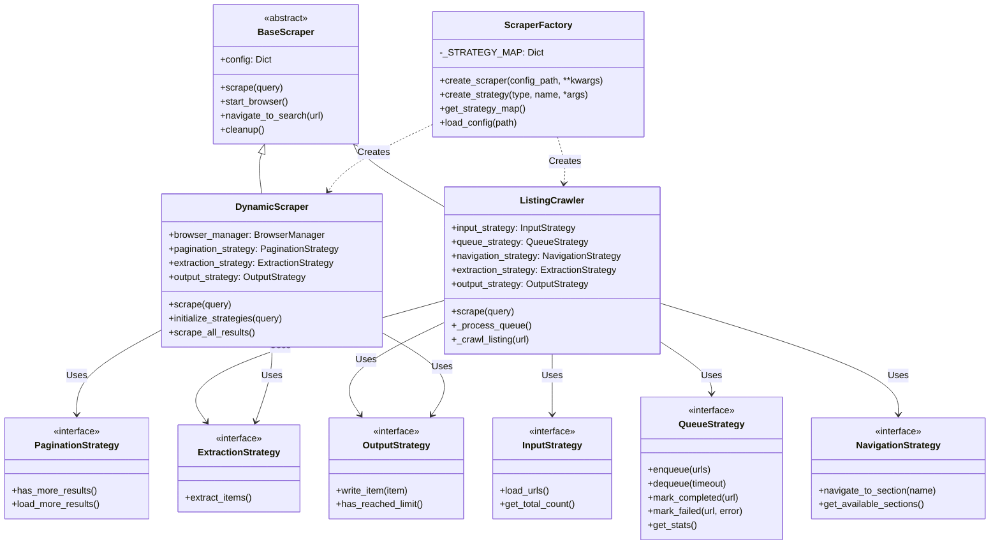

# Google Maps Scraper Knowledge Base & Architecture Reference

> **CRITICAL INSTRUCTION FOR AGENTS:**
> Before acting on ANY information in this file or the codebase, you MUST verify that this document reflects the **current state** of the code.
> 1.  **Read this file** to understand the intended architecture.
> 2.  **Verify** against actual code files (e.g., `base/scraper.py`, `factory/scraper_factory.py`) using `read` or `grep`.
> 3.  **If discrepancies exist:** You MUST update this file to match the code BEFORE proceeding with any other task.
> 4.  **If you modify code:** You MUST update this file to reflect those changes immediately after implementation.

---

## 1. System Architecture Overview

### Core Design Pattern
The framework uses a **Strategy-based Factory pattern** combined with **Configuration-Driven Design**.
-   **Orchestrators**: `DynamicScraper` (search-based), `ListingCrawler` (URL-based deep extraction)
-   **Strategies**: Encapsulate specific behaviors (Input, Queue, Navigation, Pagination, Extraction, Output)
-   **Factory (`ScraperFactory`)**: Instantiates scrapers and strategies based on YAML configuration
-   **Configuration (`config/*.yaml`)**: Defines *what* to scrape and *which* strategies to use

### Component Interaction Diagram


---

## 2. Directory Structure & Key Files

| Path | Purpose | Key Components |
| :--- | :--- | :--- |
| `base/` | Abstract Base Classes & Core Interfaces | `scraper.py`, `strategies.py`, `browser_manager.py` |
| `factory/` | Object Creation & Dependency Injection | `scraper_factory.py` |
| `scrapers/` | High-Level Orchestrators | `dynamic_scraper.py`, `listing_crawler.py` |
| `strategies/input/` | URL Input Strategies | `file_url_loader.py` |
| `strategies/queue/` | Queue Management | `redis_queue.py` |
| `strategies/navigation/` | Page Navigation | `tab_navigator.py`, `accordion_navigator.py`, `modal_navigator.py` |
| `strategies/pagination/` | Result Pagination | `infinite_scroll.py`, `next_button.py` |
| `strategies/extraction/` | Data Extraction | `generic_selector.py`, `multi_step.py` |
| `strategies/output/` | Data Persistence | `jsonl_file.py`, `null_output.py`, `postgresql.py`, `composite.py` |
| `utils/` | Utility Modules | `helpers.py` (DelayManager, URLProcessor) |
| `config/` | YAML Configuration Files | `google_maps.yaml`, `gmaps_listings.yaml`, `yelp_example.yaml` |
| `output/` | Data Persistence Directory | legacy `*.jsonl` files (default Google Maps configs now write to PostgreSQL) |
| `main.py` | CLI Entry Point | Argument parsing, logging setup |
| `.agents/` | Agent Personas & Protocols | `knowledge-base.md`, `refinement-agent.md` |
| `AGENTS.md` | Project-Wide AI Protocol | Core directives, constraints, style guide |

---

## 3. API Reference

### Base Classes (`base/`)

#### `BaseScraper` (`base/scraper.py`)
-   `__init__(self, config: Dict, **kwargs)`: Initializes config and state.
-   `scrape(self, query: str)`: Abstract method for main execution.
-   `start_browser(self)`: Abstract method to launch browser.
-   `navigate_to_search(self, url: str)`: Abstract method to load target URL.
-   `cleanup(self)`: Abstract method to release resources.

#### `InputStrategy` (`base/strategies.py`) - NEW
-   `load_urls(self) -> Iterator[str]`: Yield URLs from input source.
-   `get_total_count(self) -> Optional[int]`: Return total count if known.

#### `QueueStrategy` (`base/strategies.py`) - NEW
-   `enqueue(self, urls: List[str]) -> int`: Add URLs to queue.
-   `dequeue(self, timeout: int) -> Optional[str]`: Get next URL.
-   `mark_completed(self, url: str)`: Mark URL as done.
-   `mark_failed(self, url: str, error: str, retry_count: int)`: Mark URL as failed.
-   `get_stats(self) -> Dict`: Return queue statistics.

#### `NavigationStrategy` (`base/strategies.py`) - NEW
-   `navigate_to_section(self, section_name: str) -> bool`: Navigate to page section.
-   `get_available_sections(self) -> List[str]`: List available sections.

#### `PaginationStrategy` (`base/strategies.py`)
-   `has_more_results(self) -> bool`: Checks if more pages/scrolls exist.
-   `load_more_results(self) -> bool`: Executes the action to load more.

#### `ExtractionStrategy` (`base/strategies.py`)
-   `extract_items(self) -> List[Dict]`: Parses page content into structured data.

#### `OutputStrategy` (`base/strategies.py`)
-   `write_item(self, item: Dict)`: Persists a single item.
-   `has_reached_limit(self) -> bool`: Check if max results reached.

### Implementations

#### `ListingCrawler` (`scrapers/listing_crawler.py`) - NEW
-   **Purpose**: Deep extraction from individual listing URLs using queue-based processing.
-   **Key Logic**:
    -   `scrape()`: Main orchestration, loads URLs, processes queue.
    -   `_process_queue()`: Main loop - dequeue URL, crawl, mark complete/failed.
    -   `_crawl_listing(url)`: Process single URL with extraction pipeline.
    -   `_restart_browser()`: Restart browser every N pages to prevent memory leaks.
-   **Components**: InputStrategy, QueueStrategy, NavigationStrategy, ExtractionStrategy, OutputStrategy.

#### `DynamicScraper` (`scrapers/dynamic_scraper.py`)
-   **Purpose**: Search-based scraping with pagination.
-   **Key Logic**:
    -   `get_search_url(query)`: Substitutes `{query}` in template.
    -   `initialize_strategies(query)`: Uses Factory to create strategy instances.
    -   `scrape_all_results()`: Main loop with pagination.

#### `FileInputStrategy` (`strategies/input/file_url_loader.py`)
-   Load URLs from text file, one per line.
-   Support for deduplication and comment lines (#).

#### `RedisQueueStrategy` (`strategies/queue/redis_queue.py`)
-   Redis-based distributed queue with atomic operations.
-   Features: deduplication, visibility timeout, retry logic.

#### `TabNavigationStrategy` (`strategies/navigation/tab_navigator.py`)
-   Navigate between tabs on detail pages.
-   Waits for content to load after tab switch.

#### `MultiStepExtractionStrategy` (`strategies/extraction/multi_step.py`)
-   Execute extraction pipeline with multiple steps.
-   Actions: extract, navigate, extract_url, transform, conditional.
-   Supports field extraction with regex, lists, attributes.

#### `JsonlFileOutputStrategy` (`strategies/output/jsonl_file.py`)
-   Append items to JSONL file with atomic writes.
-   Supports max results limit.

#### `NullOutputStrategy` (`strategies/output/null_output.py`)
-   No-op output strategy used when persistence is optional.

#### `PostgreSQLOutputStrategy` / `PostgreSQLUpsertStrategy` / `PostgreSQLListingDetailsUpsertStrategy` (`strategies/output/postgresql.py`)
-   Persist scraped data to PostgreSQL with insert/upsert behavior.
-   Listing details strategy writes typed columns plus JSONB payload.

#### `CompositeOutputStrategy` (`strategies/output/composite.py`)
-   Fan out writes to multiple output strategies.
-   Used when dual persistence is desired.

### Utility Classes (`utils/helpers.py`)

#### `DelayManager`
-   `apply_delay(delay_type: str)`: Apply context-aware delays.
-   `apply_human_like_pattern()`: Apply realistic human-like delays.
-   Supports: random, normal, fixed distributions.

#### `URLProcessor`
-   `extract_pattern(url, pattern)`: Extract value from URL using regex.
-   `normalize_url(url)`: Remove tracking parameters.
-   `get_domain(url)`: Extract domain from URL.

---

## 4. Configuration Schema Reference

### Search-Based Scraping (`DynamicScraper`)

| Field | Type | Description | Default/Example |
| :--- | :--- | :--- | :--- |
| `content_type` | string | "dynamic" for search-based | "dynamic" |
| `search_url_template` | string | URL pattern with `{query}` | `https://site.com/search?q={query}` |
| `pagination_strategy` | string | "infinite_scroll", "next_button" | "infinite_scroll" |
| `extraction_strategy` | string | "generic_selector" | "generic_selector" |
| `output_strategy` | string | "jsonl_file", "postgresql_upsert", "postgresql_listing_upsert", "composite" | "postgresql_upsert" for Google Maps search configs |
| `selectors` | dict | CSS selectors for extraction | `{items: "div.card", fields: {...}}` |
| `rate_limit` | int | Seconds between actions | `2` |

### Listing-Based Scraping (`ListingCrawler`)

| Field | Type | Description | Default/Example |
| :--- | :--- | :--- | :--- |
| `content_type` | string | "listing_crawler" for URL-based | "listing_crawler" |
| `input` | dict | Input strategy config | `{strategy: "file_url_loader", config: {...}}` |
| `queue` | dict | Queue strategy config | `{strategy: "redis_queue", config: {...}}` |
| `navigation` | dict | Navigation strategy config | `{strategy: "tab_navigator", config: {...}}` |
| `extraction` | dict | Extraction pipeline steps | `{strategy: "multi_step", config: {steps: [...]}}` |
| `output` | dict | Primary output config | `{strategy: "postgresql_upsert", config: {...}}` |
| `secondary_output` | dict | Backup output config | Optional; usually omitted for PostgreSQL-only runs |
| `rate_limiting` | dict | Delay configuration | `{between_requests: [8, 15]}` |
| `workers` | dict | Worker settings | `{count: 3, max_pages_per_session: 100}` |

---

## 5. Extension Guide

### Adding a New Input Strategy
1.  Create `strategies/input/my_loader.py`.
2.  Inherit from `InputStrategy`.
3.  Implement `load_urls()` and `get_total_count()`.
4.  Register in `factory/scraper_factory.py`.

### Adding a New Queue Strategy
1.  Create `strategies/queue/my_queue.py`.
2.  Inherit from `QueueStrategy`.
3.  Implement all required methods.
4.  Register in `factory/scraper_factory.py`.

### Adding a New Navigation Strategy
1.  Create `strategies/navigation/my_navigator.py`.
2.  Inherit from `NavigationStrategy`.
3.  Implement `navigate_to_section()` and `get_available_sections()`.
4.  Register in `factory/scraper_factory.py`.

### Adding a New Pagination Strategy
1.  Create `strategies/pagination/my_strategy.py`.
2.  Inherit from `PaginationStrategy`.
3.  Implement `has_more_results()` and `load_more_results()`.
4.  Register in `factory/scraper_factory.py`.

### Adding a New Extraction Strategy
1.  Create `strategies/extraction/my_extractor.py`.
2.  Inherit from `ExtractionStrategy`.
3.  Implement `extract_items()`.
4.  Register in `factory/scraper_factory.py`.

### Adding a New Website Configuration
1.  Create `config/new_site.yaml`.
2.  Define appropriate strategies for the site structure.
3.  Run using `uv run python main.py --config config/new_site.yaml`.

---

## 6. Usage Examples

### Run Google Maps Listing Crawler
```bash
# Ensure Redis is running
redis-server

# Run the crawler
uv run python main.py --config config/gmaps_listings.yaml
```

### Run Search-Based Scraper
```bash
uv run python main.py --config config/google_maps.yaml --query "restaurants NYC"
```

---

## 7. Optimization & Best Practices

-   **Memory**: `ListingCrawler` processes URLs one at a time. Browser restarts every 100 pages prevent leaks.
-   **Anti-Bot**: Use human-like delays (8-15s between listings). Enable `headless=True` for production.
-   **Rate Limiting**: Configure `rate_limiting.between_requests` based on target site sensitivity.
-   **Queue Resilience**: Redis queue provides fault tolerance with visibility timeout and retry logic.
-   **Error Handling**: Failed URLs are logged with detailed error info for debugging.

---

## 8. Troubleshooting

-   **Circular Import Errors**: Move imports inside `get_strategy_map()` in factory.
-   **Redis Connection**: Ensure Redis is running on configured host/port.
-   **Selector Failures**: Use browser dev tools to verify selectors match current DOM.
-   **Rate Limiting**: Increase delays if getting blocked (429 errors).
-   **Memory Issues**: Decrease `max_pages_per_session` to restart browser more frequently.

---
**LAST UPDATED:** 2026-02-04
**STATUS:** Active & Verified
