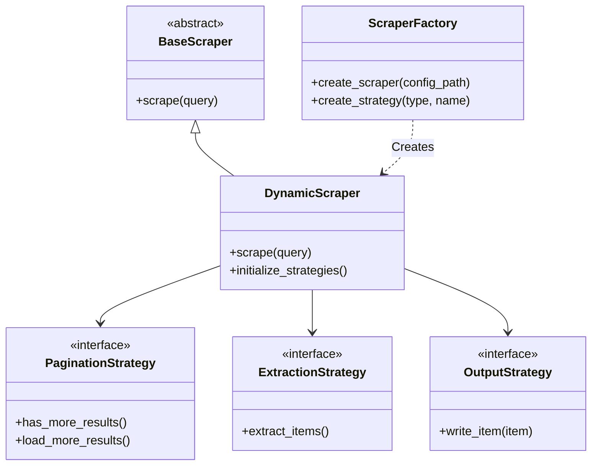

# Architecture Guide

This framework implements a **Strategy-based Factory pattern** to separate the *what* (configuration) from the *how* (execution).

## High-Level Design

The system revolves around the `DynamicScraper`, which orchestrates three interchangeable strategies: Pagination, Extraction, and Output.

## Component Breakdown

### 1. The Factory (`factory/`)
The `ScraperFactory` reads YAML configuration files and instantiates the correct strategies. It uses a lazy-loading mechanism to avoid circular imports and reduce startup time.

### 2. Strategies (`strategies/`)
*   **Pagination**: Handles navigation.
    *   `InfiniteScrollPaginationStrategy`: Scrolls to the bottom of specific containers (e.g., Google Maps feed).
    *   `NextButtonPaginationStrategy`: Clicks specific DOM elements to advance pages.
*   **Extraction**: Handles parsing.
    *   `GenericSelectorExtractionStrategy`: Uses CSS selectors defined in YAML to map DOM elements to data fields.
*   **Output**: Handles persistence.
    *   `JsonlFileOutputStrategy`: Writes atomic records to newline-delimited JSON files.

## Extension Guide

### Adding a New Website
For 90% of use cases, no code is required. Create a new file in `config/`:

1.  Identify the content type (Static vs. Dynamic).
2.  Inspect the DOM to find CSS selectors for items and fields.
3.  Identify the pagination mechanism (Scroll vs. Button).
4.  Create `config/my_site.yaml` (see `CONFIGURATION.md`).

### Adding a New Strategy
If a site requires unique logic (e.g., solving a captcha or complex API signing):

1.  Create a new class in `strategies/<type>/` inheriting from the base ABC.
2.  Implement the required methods.
3.  Register the strategy in `factory/scraper_factory.py`.
