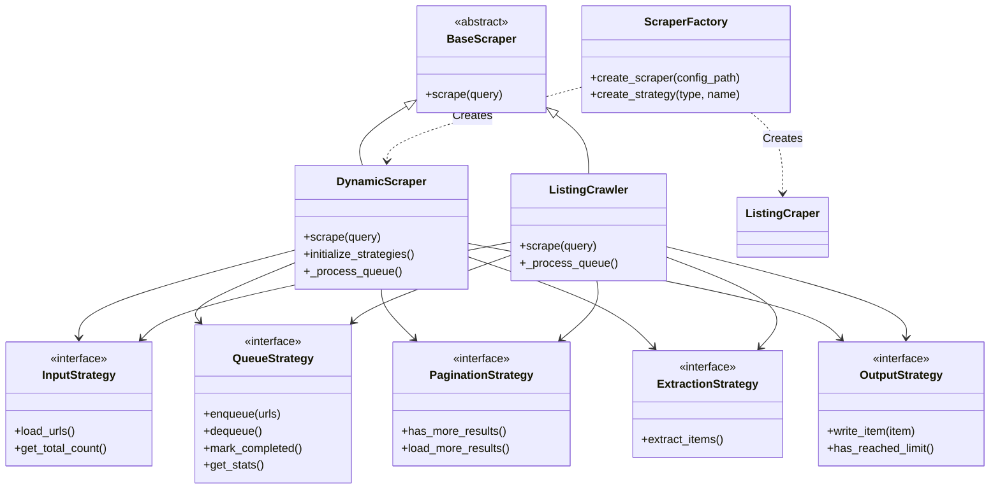

# Architecture Guide

This framework implements a **Strategy-based Factory pattern** to separate the *what* (configuration) from the *how* (execution).

## High-Level Design

The system revolves around orchestrating multiple interchangeable strategies: Input, Queue, Pagination, Extraction, and Output.



## Data Flow

```
┌─────────────────────────────────────────────────────────────────┐
│                        Scraping Pipeline                          │
├─────────────────────────────────────────────────────────────────┤
│                                                                  │
│  1. INPUT                                                      │
│  ┌─────────────────┐    ┌─────────────────────────────────┐   │
│  │  file_url_loader │───▶│  Load URLs/Queries from file  │   │
│  └─────────────────┘    └─────────────────────────────────┘   │
│                            │                                    │
│                            ▼                                    │
│  2. QUEUE (Optional)                                           │
│  ┌──────────────────────────────────────────────────────────┐   │
│  │  Redis Queue: pending → processing → completed         │   │
│  │  - Tracks progress across runs                          │   │
│  │  - Handles failures and retries                        │   │
│  │  - Supports distributed processing                      │   │
│  └──────────────────────────────────────────────────────────┘   │
│                            │                                    │
│                            ▼                                    │
│  3. BROWSER (nodriver)                                        │
│  ┌──────────────────────────────────────────────────────────┐   │
│  │  - Headless Chrome automation                          │   │
│  │  - Automatic page navigation                           │   │
│  │  - Tab management                                      │   │
│  │  - Session lifecycle (restart every N pages)           │   │
│  └──────────────────────────────────────────────────────────┘   │
│                            │                                    │
│                            ▼                                    │
│  4. PAGINATION                                                 │
│  ┌─────────────────┐    ┌─────────────────────────────────┐   │
│  │ infinite_scroll │    │  next_button                    │   │
│  └─────────────────┘    └─────────────────────────────────┘   │
│                            │                                    │
│                            ▼                                    │
│  5. EXTRACTION                                                │
│  ┌──────────────────────────────────────────────────────────┐   │
│  │  - CSS selector-based extraction                        │   │
│  │  - Multi-field support                                 │   │
│  │  - Fallback selectors                                  │   │
│  │  - Retry logic                                        │   │
│  └──────────────────────────────────────────────────────────┘   │
│                            │                                    │
│                            ▼                                    │
│  6. OUTPUT                                                    │
│  ┌──────────────────────────────────────────────────────────┐   │
│  │  - MongoDB (primary)                                   │   │
│  │  - JSONL file (fallback)                              │   │
│  │  - Composite (multiple outputs)                       │   │
│  └──────────────────────────────────────────────────────────┘   │
│                                                                  │
└─────────────────────────────────────────────────────────────────┘
```

## Component Breakdown

### 1. The Factory (`factory/`)

The `ScraperFactory` reads YAML configuration files and instantiates the correct strategies. It uses a lazy-loading mechanism to avoid circular imports and reduce startup time.

### 2. Input Strategies (`strategies/input/`)

Loads URLs or queries from various sources.

| Strategy | Description |
|----------|-------------|
| `file_url_loader` | Loads URLs/queries from text file (one per line) |

### 3. Queue Strategies (`strategies/queue/`)

Manages URL/query processing with tracking.

| Strategy | Description |
|----------|-------------|
| `redis_queue` | Redis-based queue with pending/processing/completed/failed states |

### 4. Pagination Strategies (`strategies/pagination/`)

Handles navigation and loading more results.

| Strategy | Description |
|----------|-------------|
| `infinite_scroll` | Scrolls to load more results in container |
| `next_button` | Clicks pagination buttons |

### 5. Extraction Strategies (`strategies/extraction/`)

Parses page content to extract data.

| Strategy | Description |
|----------|-------------|
| `generic_selector` | CSS selector-based extraction |
| `multi_step` | Multi-stage extraction with retry logic |

### 6. Output Strategies (`strategies/output/`)

Handles data persistence.

| Strategy | Description |
|----------|-------------|
| `jsonl_file` | Line-delimited JSON file |
| `mongodb` | MongoDB insert |
| `mongodb_upsert` | MongoDB upsert by key field |
| `composite` | Multiple outputs with fallback |

## Scraper Types

### DynamicScraper

For JavaScript-heavy websites requiring browser automation.

- Uses: `input` + `queue` + `pagination` + `extraction` + `output`
- Example: Google Maps search scraping

### ListingCrawler

For extracting detailed information from known URLs.

- Uses: `input` + `queue` + `navigation` + `extraction` + `output`
- Example: Google Maps business listing extraction

## Extension Guide

### Adding a New Website

For 90% of use cases, no code is required. Create a new file in `config/`:

1.  Identify the content type (`dynamic` or `listing_crawler`)
2.  Inspect the DOM to find CSS selectors for items and fields
3.  Identify the pagination mechanism (`infinite_scroll` or `next_button`)
4.  Create `config/my_site.yaml` (see `CONFIGURATION.md`)

### Adding a New Strategy

If a site requires unique logic:

1.  Create a new class in `strategies/<type>/` inheriting from the base ABC
2.  Implement the required methods
3.  Register the strategy in `factory/scraper_factory.py`
